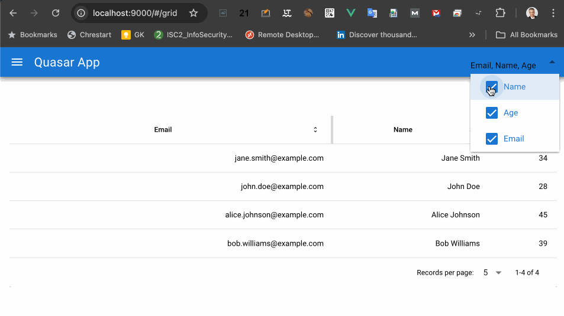

# Quasar App (custom-quasar-table-component)
The CQTable component illustrates how to create your own quasar component by extending existing ones, in this case the QTable component.



## Install the dependencies
```bash
yarn
# or
npm install
```

## Start the app in development mode (hot-code reloading, error reporting, etc.)
```bash
quasar dev
```

## Go to the /#/grid path to see it in action.

## How was this project built? DIY from scratch
```
npm install -g @quasar/cli
cd Downloads
quasar create quasar-sandbox
cd quasar-sandbox
npm install
vi src/components/CQTable.vue
vi src/pages/GridPage.vue
vi src/router/routes.js
```
